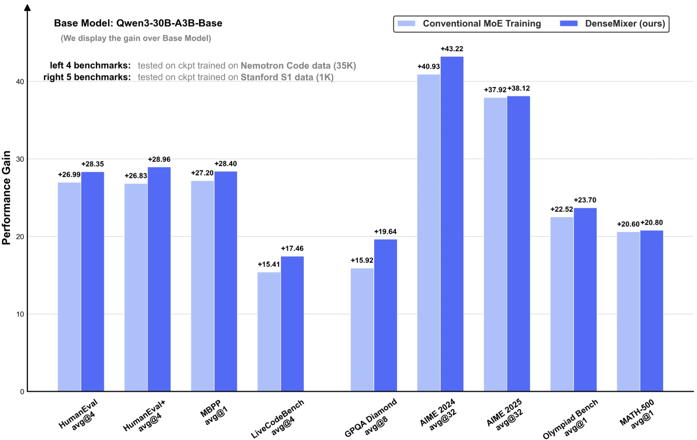

<h1 align="center">🎨 DenseMixer 🎨</h1>
<p align="center"><b>Improving MoE Post-Training with Precise Router Gradients</b>  
(<a href="https://fengyao.notion.site/moe-posttraining">Blog</a>)</p>

<p align="center">
  
  
    
</p>

<p align="center">
  <a href="#what-is-densemixer">What is DenseMixer?</a> •
  <a href="#-key-features">Key Features</a> •
  <a href="#-experiments">Experiments</a> •
  <a href="#-quick-start">Quick Start</a> •
  <a href="#-efficiency-analysis">Efficiency</a> •
  <a href="#-citation">Citation</a>
</p>

[DenseMixer](https://fengyao.notion.site/moe-posttraining) is a novel MoE post-training technique that empowers MoE training with more precise router gradient estimation, consistently outperforming conventional MoE training in downstream tasks.

<h3 align="center" id="what-is-densemixer"><i>What is DenseMixer?</i></h3>

**DenseMixer** addresses the non-differentiable Top-K routing problem in MoE training by implementing a straight-through estimator (STE). This enables more precise router gradients by computing outputs from all experts during forward pass for better gradient estimation during backward pass. For technical details and mathematical formulation, please refer to our [blog](https://fengyao.notion.site/moe-posttraining).

## 🚀 Key Features

- **Plug-and-play**: Zero code changes required
- **Universal compatibility**: Works with any MoE using Top-K routing
- **Performance gains**: Consistently outperforms conventional MoE training
- **Parameter-efficient**: Compatible with LoRA and other PEFT methods
- **No inference overhead**: Zero impact on model inference speed

## 📈 Experiments

DenseMixer consistently outperforms conventional MoE training across:

- **Model scales**: 7B, 14B, 30B parameters
- **Architectures**: With/without shared experts
- **Training methods**: From scratch and up-cycling
- **Data types**: Instruction tuning and long reasoning data

<p align="center">
  
</p>

**Reproducible Experiments**: For detailed training scripts, configurations, and evaluation code, please refer to the [experiments](./experiments/) folder.

<details>
<summary><b>📊 Qwen1.5-MoE-A2.7B (14B):</b> +2.2% average improvement across 7 tasks</summary>

| Method | GSM | MBPP | HumanEval | Intent | Law | Summary | Translation | Avg |
|--------|-----|------|-----------|--------|-----|---------|-------------|-----|
| Base Model | 38.69 | 38.84 | 32.31 | 16.83 | 18.20 | 28.29 | 16.53 | 27.10 |
| Conventional | 53.42 | 34.60 | 36.43 | 81.80 | 29.25 | 37.80 | 33.02 | 43.76 |
| **DenseMixer** | **55.16** | **35.40** | **39.68** | **83.40** | **33.83** | **40.56** | **33.90** | **45.99** |
| *Gain* | **+1.74** | **+0.80** | **+3.25** | **+1.60** | **+4.58** | **+2.76** | **+0.88** | **+2.23** |

</details>


<details>
<summary><b>📊 OLMoE-1B-7B:</b> +2.9% average improvement across 7 tasks</summary>

| Method | GSM | MBPP | HumanEval | Intent | Law | Summary | Translation | Avg |
|--------|-----|------|-----------|--------|-----|---------|-------------|-----|
| Base Model | 15.85 | 19.80 | 10.97 | 0.20 | 5.70 | 7.40 | 11.09 | 10.14 |
| Conventional | 45.94 | 23.4 | 18.92 | 74.60 | 22.35 | 35.99 | 26.89 | 35.44 |
| **DenseMixer** | **49.00** | **25.12** | **20.73** | **77.40** | **23.02** | **40.64** | **32.55** | **38.35** |
| *Gain* | **+3.06** | **+1.72** | **+1.81** | **+2.80** | **+0.67** | **+4.65** | **+5.66** | **+2.91** |

</details>


<details>
<summary><b>📊 Qwen3-30B-A3B:</b> +3.7% improvement on GPQA-Diamond</summary>

**Nemotron-Code Dataset (35K samples):**

| Method | HumanEval (avg@4) | HumanEval+ (avg@4) | MBPP (avg@1) | LiveCodeBench (avg@4) | Avg |
|--------|-------------------|-------------------|--------------|----------------------|-----|
| Base Model | 65.24 | 60.06 | 53.60 | 16.85 | 48.94 |
| Conventional | 92.23 | 86.89 | 80.80 | 32.26 | 67.21 |
| **DenseMixer** | **93.59** | **89.02** | **82.00** | **34.31** | **68.80** |
| *Gain* | **+1.36** | **+2.13** | **+1.20** | **+2.05** | **+1.59** |

**Stanford S1 Dataset (1K samples):**

| Method | GPQA Diamond (avg@8) | AIME 2024 (avg@32) | AIME 2025 (avg@32) | Olympiad Bench (avg@1) | MATH-500 (avg@1) | Avg |
|--------|---------------------|-------------------|-------------------|----------------------|------------------|-----|
| Base Model | 38.88 | 20.63 | 7.71 | 34.81 | 72.80 | 34.97 |
| Conventional | 54.80 | 61.56 | 45.63 | 57.33 | 93.40 | 62.54 |
| **DenseMixer** | **58.52** | **63.85** | **45.83** | **58.51** | **93.60** | **64.06** |
| *Gain* | **+3.72** | **+2.29** | **+0.20** | **+1.18** | **+0.20** | **+1.52** |

*Results shown for temperature=0.6, top_p=0.95 decoding parameters*

</details>


## ⚡ Quick Start

### 1. Installation

```bash
pip install densemixer
```

### 2. Setup (One-time)

```bash
densemixer setup
```

### 3. Enable DenseMixer

```bash
export DENSEMIXER_ENABLED=1
```

### 4. Use Your MoE Models

```python
from transformers import Qwen3MoeForCausalLM

# DenseMixer automatically patches the model
model = Qwen3MoeForCausalLM.from_pretrained("Qwen/Qwen3-MoE-30B-A3B")

# Train as usual - no code changes needed!
```

## 🔧 Configuration

DenseMixer currently supports the following models.

- [Qwen3-MoE](https://huggingface.co/Qwen/Qwen3-30B-A3B-Base) (30B parameters)
- [Qwen1.5-MoE](https://huggingface.co/Qwen/Qwen1.5-MoE-A2.7B) (14B parameters)
- [OLMoE](https://huggingface.co/allenai/OLMoE-1B-7B-0125) (7B parameters)

DenseMixer uses environment variables for configuration:

| Variable | Description | Default |
|----------|-------------|---------|
| `DENSEMIXER_ENABLED` | Master switch (set to `1` to enable) | `0` |
| `DENSEMIXER_QWEN3` | Enable for Qwen3-MoE models | `1` |
| `DENSEMIXER_QWEN2` | Enable for Qwen1.5-MoE models | `1` |
| `DENSEMIXER_OLMOE` | Enable for OLMoE models | `1` |

### Usage Examples

**Enable for all models:**
```bash
export DENSEMIXER_ENABLED=1
python your_training_script.py
```

**Enable only for specific models:**
```bash
export DENSEMIXER_ENABLED=1
export DENSEMIXER_QWEN3=1
export DENSEMIXER_QWEN2=0
export DENSEMIXER_OLMOE=0
python your_training_script.py
```

**Disable (default behavior):**
```bash
# No environment variables needed
python your_training_script.py
```

## 📊 Logging

DenseMixer provides intelligent logging to track when custom forward methods are used:

```
INFO - densemixer - DenseMixer: Using custom forward method for Qwen3-MoE
INFO - densemixer - DenseMixer: Using custom forward method for OLMoE
```

You can also customize the logging as below.

```python
import logging

# Set logging level
logging.getLogger("densemixer").setLevel(logging.INFO)

# Or disable logging entirely
logging.getLogger("densemixer").setLevel(logging.WARNING)
```

## ⚡ Efficiency Analysis

**FLOPs**: **1.46x** overhead vs conventional training (theoretical analysis on Qwen3-30B-A3B)

<details>
<summary><b>📊 Detailed FLOPs Analysis</b></summary>

```bash
Model Training Cost Analysis Results --- Conventional Training for Qwen3-30B-A3B ---
Number of parameters: 30,431,444,992
Number of Forward TFLOPs per layer: 16.85
Number of Backward TFLOPs per layer: 33.70
Number of TFLOPs per layer: 50.54
Peak memory cost: 157.93 GBs


Model Training Cost Analysis Results --- DenseMixer Training for Qwen3-30B-A3B ---
Number of parameters: 30,431,444,992
Number of Forward TFLOPs per layer: 40.04
Number of Backward TFLOPs per layer: 33.70 # we assume DenseMixer doesn't change backward significantly
Number of TFLOPs per layer: 73.74
Peak memory cost: 164.96 GBs

FLOPs: DenseMixer / Conventional = 1.46x
```

*Detailed FLOPs analysis available in [efficiency_analysis/flops_compute.py](./efficiency_analysis/flops_compute.py)*

</details>

**Memory**: Negligible overhead - model weights are already loaded on GPU  

**Time**: Negligible when training with small scale of data

*Detailed FLOPs analysis available in [efficiency_analysis/flops_compute.py](./efficiency_analysis/flops_compute.py)*

| Model | Dataset | Conventional | DenseMixer | Overhead |
|-------|---------|--------------|------------|----------|
| Qwen1.5-MoE | Intent (7K) | 22 min | 24 min | +9% |
| Qwen3-MoE | S1 (1K) | 2.8h | 3.6h | +29% |

## 📚 Citation

If you find our work useful, please cite us:

```bibtex
@misc{yao2025densemixer,
  title = {DenseMixer: Solving MoE Post-Training with Precise Router Gradients},
  url = {https://fengyao.notion.site/moe-posttraining},
  author = {Yao, Feng and Cui, Junxia and Zhang, Ruohan and Liu, Liyuan and Hao, Shibo and Zhang, Li and Dong, Chengyu and Wang, Shuohang and Shen, Yelong and Gao, Jianfeng and Shang, Jingbo},
  journal = {Feng Yao's Notion},
  year = {2025},
  month = jun
}
```

## Questions?

If you have any questions related to the code or the blog, feel free to reach out to us at [fengyao@ucsd.edu](mailto:fengyao@ucsd.edu).
